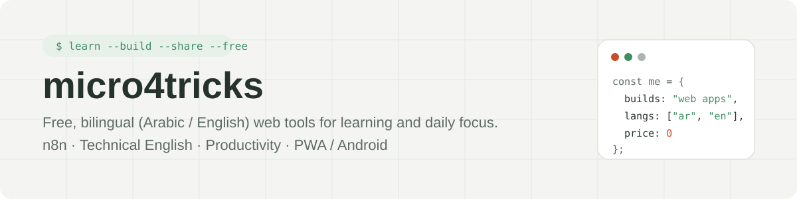
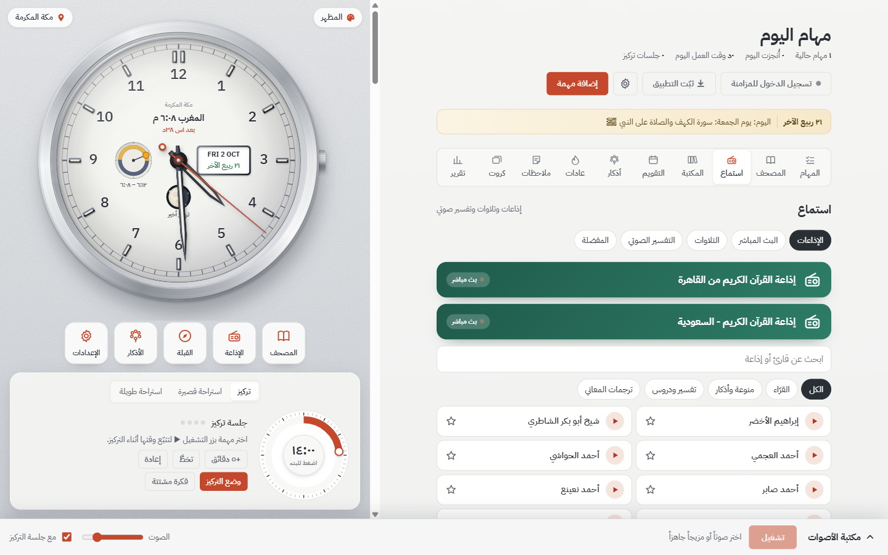
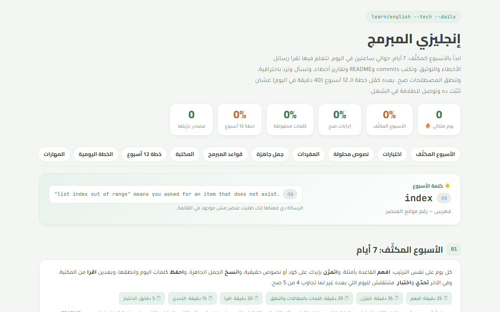

  

  
  
  

### 👋 Hi, I'm Mahmoud Habashi · أهلاً، أنا محمود حبشي

I build **free, bilingual web tools** that run entirely in the browser — no sign-up, no ads, no tracking. Every project works in **Arabic and English** with one click, and saves your progress on your own device.

أبني **أدوات ويب مجانية بالعربي والإنجليزي** تعمل بالكامل في المتصفح، بدون تسجيل ولا إعلانات ولا تتبّع. كل مشروع يتحوّل بين العربي والإنجليزي بضغطة زر، ويحفظ تقدّمك على جهازك.

---

## 🚀 Projects · المشاريع

<table>
  <tr>
    <td width="50%" valign="top">
      
      <h3> <a href="https://github.com/micro4tricks-ai/muslim-todo-list">Muslim To-Do List</a></h3>
      
Tasks planned around prayer times, a watch-face clock with the Hijri date and moon phase, a Pomodoro focus mode, habits, adhkar, review cards and focus sounds. Syncs across devices; installs as a PWA or an Android app.

      
مهام مرتّبة حول أوقات الصلاة، وساعة بالتاريخ الهجري وطور القمر، ووضع تركيز، وعادات وأذكار وأصوات تركيز.

      

        <a href="https://micro4tricks-ai.github.io/muslim-todo-list/"><b>Open the app →</b></a> ·
        <a href="https://github.com/micro4tricks-ai/muslim-todo-list/releases/latest">Android APK</a>
      

    </td>
    <td width="50%" valign="top">
      
      <h3> <a href="https://github.com/micro4tricks-ai/learn-n8n-english">Developer Journey · رحلة المبرمج</a></h3>
      
Two learning plans in one site: <b>n8n automation</b> with JavaScript, Python, SQL, Docker and AI, and <b>technical English</b> for developers. Each starts with a 7-day intensive week, then a 12-week plan, with quizzes, flashcards and a library of 135+ free sources.

      
خطتان: أتمتة n8n واللغات المرتبطة بها، والإنجليزية التقنية للمبرمجين.

      
<a href="https://micro4tricks-ai.github.io/learn-n8n-english/"><b>Start learning →</b></a>

    </td>
  </tr>
  <tr>
    <td width="50%" valign="top">
      
      <h3> <a href="https://github.com/micro4tricks-ai/programmer-english">Programmer English · إنجليزي المبرمج</a></h3>
      
The English a developer needs every day, on one page: error messages, docs, READMEs, commits, code review, emails and interviews. 430+ words with audio, 20 worked texts, quizzes and a 12-week plan.

      
الإنجليزية التي يحتاجها المبرمج يومياً: رسائل الأخطاء والتوثيق والمراسلات والمقابلات.

      
<a href="https://micro4tricks-ai.github.io/programmer-english/"><b>Open the page →</b></a>

    </td>
    <td width="50%" valign="top">
      <h3>✨ What they share</h3>
      <ul>
        <li>🌐 <b>Arabic ⇄ English</b> with full RTL / LTR layout</li>
        <li>🔒 <b>Private by default</b> — progress stays in your browser</li>
        <li>⚡ <b>No build step</b> — plain HTML, CSS and JavaScript</li>
        <li>📱 <b>Mobile first</b> — works on phones, tablets and desktops</li>
        <li>💸 <b>Free</b> — hosted on GitHub Pages, no paywalls</li>
      </ul>
    </td>
  </tr>
</table>

---

## 🧰 Toolbox

  
  
  
  
  
  
  
  
  
  
  
  

## 📫 Contact · تواصل

Ideas, bug reports or suggestions are welcome — open an issue on any project or email **[micro4tricks@gmail.com](mailto:micro4tricks@gmail.com)**.

الاقتراحات والملاحظات مرحّب بها: افتح Issue في أي مشروع، أو راسلني على البريد.

